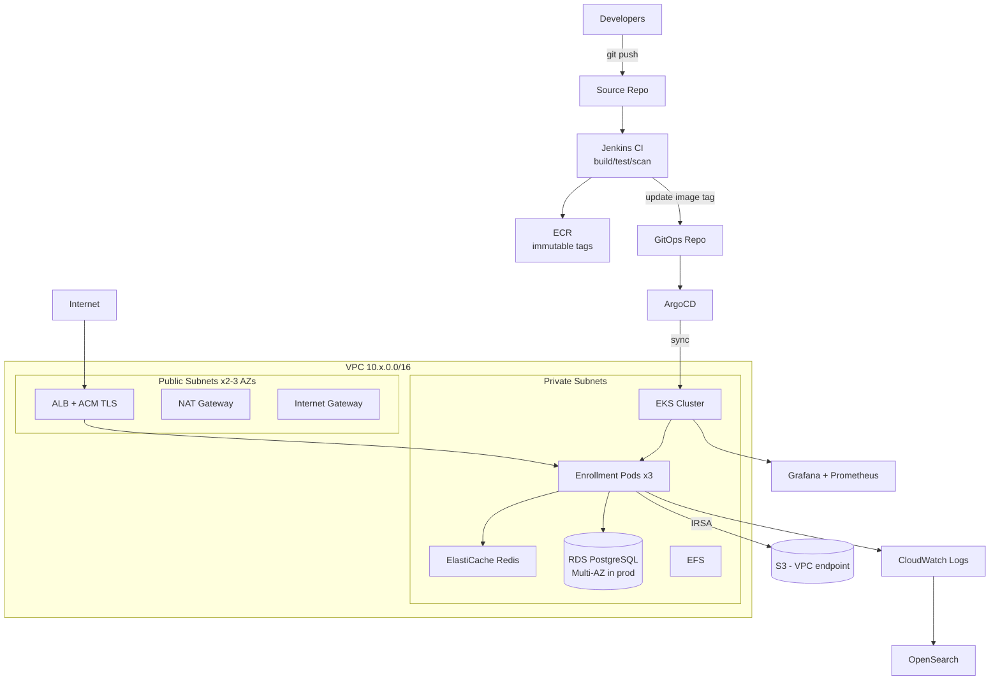

# Part A — Architecture Design

## High-level flow

## Major design decisions

1. **Private worker nodes, public ALB only.** All compute (nodes, pods, RDS, Redis)
   lives in private subnets. The only internet-facing components are the ALB and
   NAT gateway. Egress goes through NAT; S3/ECR traffic uses VPC endpoints to
   avoid NAT cost and keep traffic on the AWS backbone.

2. **Namespace strategy.** One namespace per team/domain (`enrollment`,
   `claims`, ...), plus `platform` for shared controllers (ALB controller,
   external-secrets, metrics-server) and `argocd`. ResourceQuotas + LimitRanges
   per namespace prevent one team starving another.

3. **TLS terminates at the ALB** using an ACM certificate. Inside the VPC,
   traffic is on private subnets; mTLS via a mesh is a later step if compliance
   requires in-transit encryption to the pod.

4. **IRSA for AWS access** — every pod that touches AWS gets a dedicated
   ServiceAccount bound to a least-privilege IAM role. No node-level blanket
   permissions, no static keys.

5. **Secrets**: RDS master password is generated/rotated by AWS Secrets Manager
   (`manage_master_user_password`); pods consume secrets via External Secrets
   Operator syncing Secrets Manager -> K8s Secrets. Nothing sensitive in Git.

6. **Security groups as network boundaries**: ALB SG (443 from internet) ->
   Node SG (traffic from ALB SG only on pod ports) -> RDS SG (5432 from node SG
   only). Each hop admits only the previous hop.

7. **GitOps** — Jenkins builds and publishes; ArgoCD is the only thing with
   cluster write access. Git is the single source of truth and the audit log.
